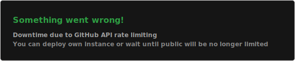
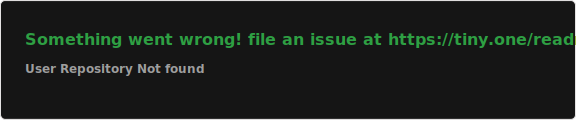

<!--
  SETUP: Copy this file as README.md
  YOUR_USERNAME → Your GitHub username
  YOUR_EMAIL, YOUR_LINKEDIN → Your contact info
  Typing lines → Your intro text
  Tech icons → Adjust to your languages
-->

  

  
  

---

### 📊 GitHub Stats

  
  &nbsp;
  

### 🗣️ Top Languages

  

### 🏆 Achievements

  

### 📈 Activity Graph

  

---

### 🛠️ Tech Stack

<table>
<tr>
<td align="center" width="33%"><b>💻 Languages</b> 

</td>
<td align="center" width="33%"><b>🎨 Frontend</b> 

</td>
<td align="center" width="33%"><b>⚙️ Backend</b> 

</td>
</tr>
</table>

---

### 🔥 Featured Projects

  
  

---

### 📬 Contact

  
  
  

---

### 🐍 Contribution Graph

<!-- Snake: Platane/snk - dark theme -->

---

  

